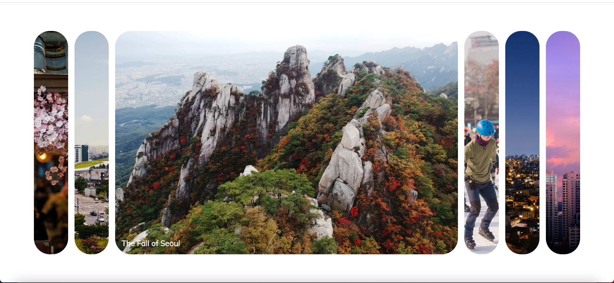

# 기능

- 사진을 클릭하면 크기가 커집니다.
- 클릭한 사진의 하단에만 사진 제목이 보입니다.
- 클릭하지 않은 사진은 사진 제목이 보이지 않습니다.

# 마우스로 누른 사진이 커지게 하는 방법

## 초기값

- HTML 파일에서 첫번째 사진이 위치한 div에만 active라는 클래스를 지정해줬습니다.
- 사진이 있는 클래스 모두를 querySelectorAll로 잡고 cursor: hover;라고 속성과 값을 추가했습니다.

## 스크립트

- 이미 지정돼 있는 active 클래스를 지우는 함수, 새롭게 active 클래스를 주는 함수를 만들었습니다.
- 클릭한 개체에 위에서 만든 두 가지 함수를 실행하도록 addEventLister를 걸었습니다.
